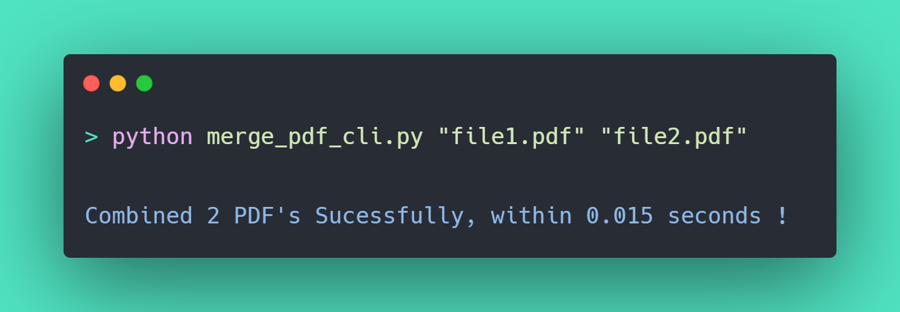

## 📄 PDF Processing

### List of scripts:

**1.** PDF Proccesing (rotating, wiriting, encrypting): [**`Code`**](https://github.com/gkrockz/pdf-processing/blob/main/pdf_processing.py)

**2.** PDF Watermark Adder: [**`Code`**](https://github.com/gkrockz/pdf-processing/blob/main/watermarker.py)

**3.** PDF Merger `(through console)`: [**`Code`**](https://github.com/gkrockz/pdf-processing/blob/main/pdf_merger_cli.py)

 
 

---
📑 **Libary reference:** [**`PyPDF2`**](https://pypi.org/project/PyPDF2/) 
